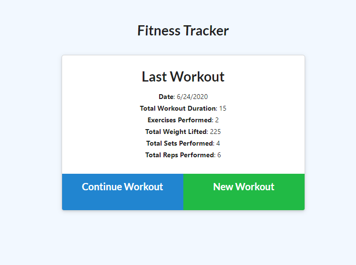

# Workout Tracker
***
Application used to track the name, type, weight, sets, reps, and duration of exercise using a Mongoose database, Mongoose schema and Express.
***

## Table of Contents
***
  * [Workout Tracker](#workout-tracker)
  * [Installation](#installation)
  * [Usage](#Usage)
  * [Technologies](#technologies)
  * [Screenshot](#screenshot)
  * [Deployed Application](#deployed-application)
***

## Installation
***
To install necessary dependencies, run the following command:

```
npm i
```
***

## Usage
***
To seed the database run:
```
node seeders/seed.js
```
To start the server run:
```
npm run server
```
***

## Technologies
***
<b>Built with</b>
- [HTML5](https://developer.mozilla.org/en-US/docs/Web/Guide/HTML/HTML5)
- [CSS3](https://developer.mozilla.org/en-US/docs/Web/CSS)
- [Javascript](https://developer.mozilla.org/en-US/docs/Web/JavaScript)
- [MongoDB](https://docs.mongodb.com/manual/)
- [Mongoose](https://mongoosejs.com/docs/)
- [NodeJs](https://nodejs.org/en/docs/)
***

## Screenshot
***


***

## Deployed Application
***
<a href="https://limitless-springs-47529.herokuapp.com/">Workout Tracker</a>
